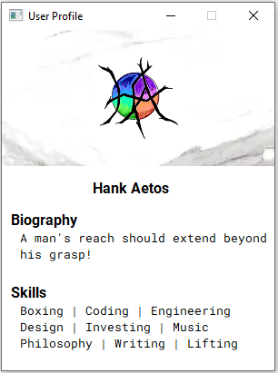

# PyQt Samples
Various GUI samples.

## Table of Contents
- [Screenshots](#screenshots)
- [Setup](#setup)
- [Example](#example)
- [License](#license)

## Screenshots
### Appointment

### Area Calculator

### Notepad

### Photo Editor

### Spin Wheel

### User Profile


## Setup
> The following is just boiler-plate; the conda package does not exist
```bash
conda install -c hankaetos lib.pkg
```

## Example
### Command-line
```bash
python app.py
```
### API
> Also boiler-plate...
```python
from hankaetos.lib.pkg import App

App.main()
```

## License
[MIT](LICENSE)
